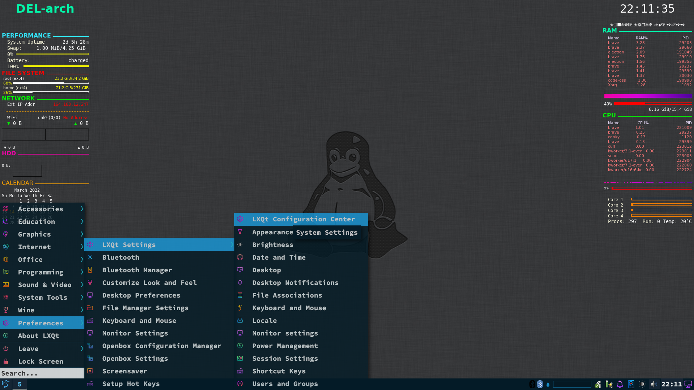
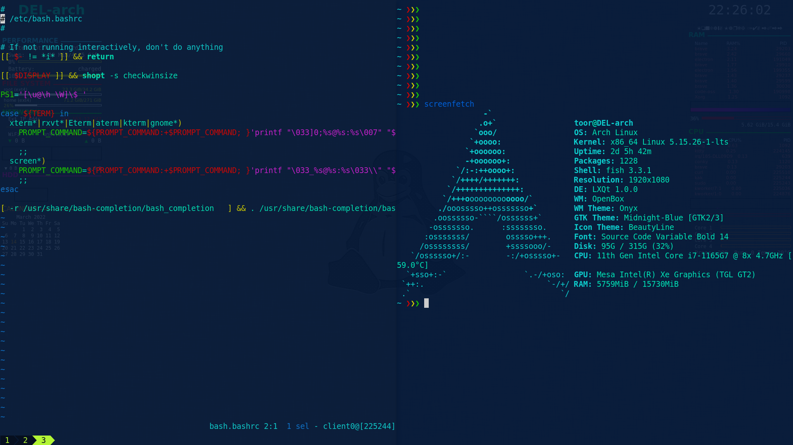
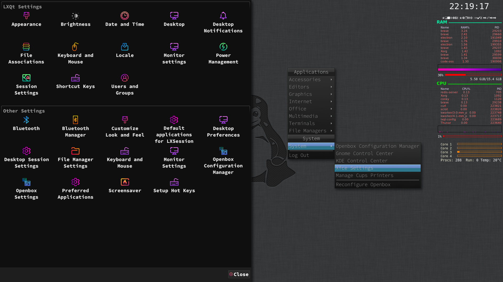
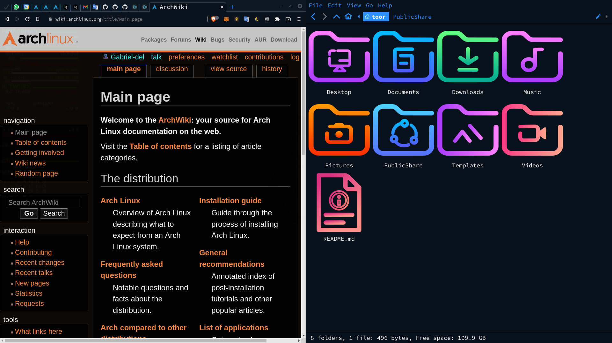

# Dotfiles

I use [Arch Linux](https://wiki.archlinux.org/title/Main_page)
And [Lxqt  WM](https://lxqt-project.org/)

        |   
:-----------------------------:|:-------------------------:
        |        

### Graphical Interface
* File manager: [Thunar](https://wiki.archlinux.org/title/Thunar)
* Browser [Brave browser](https://aur.archlinux.org/packages/brave-bin)
* Editor: [Nvim](https://wiki.archlinux.org/title/Neovim), [kakoune](https://wiki.archlinux.org/title/Kakoune) 
and [VScode](https://wiki.archlinux.org/title/Visual_Studio_Code) 
* Terminal: [Kitty](https://wiki.archlinux.org/title/Kitty)
* System Monitor: [Conky](https://wiki.archlinux.org/title/Conky)
* Theme: [Midnight-blue](https://aur.archlinux.org/packages/midnight-gtk-theme-git)
* Icons: [BeautyLine](https://aur.archlinux.org/packages/beautyline)
* Cursor: [Sweet-Cursors](https://aur.archlinux.org/packages/sweet-cursor-theme-git)
* Font: [Nerdfonts](https://aur.archlinux.org/packages/nerd-fonts-complete)

### Shell
[Fish](https://fishshell.com/)
with the [Replay](https://github.com/jorgebucaran/replay.fish)
is the best combination,
it allow to have [Aliases](https://wiki.archlinux.org/title/Bash#Aliases)
in sync with [Bash](https://wiki.archlinux.org/title/Bash)

On *.aliases* and *.bin* there is configs as:
* **i** and **ii**: Allow to install anything automatically.
Shortcut to **pacman -S --noconfirm** 
* **c**: Enter any folder with just part of the name.
For example, just type:
```bash
c sys
```
instead of
```bash
cd 'System Volume Information'
```
* **e**: Same as **c** but to files. 
Also allow edit any file using root permition, but keeping user configs
using **sudo -E $EDITOR**
* **mountp**: Mount vfat filesystems with user permissions
* **...**: Shortcut to **cd ../.. && ls**
* Auto-sudo  without need to type sudo, neither password
* **hd o**: Open and mount encrypted HardDrive easily
* **$PATH** setted statically, and on sync between **bash** and **fish**
* **aliases**: Update the configs on **bash** and **fish**

### System
All this files are inside *.system*
[CryptSetup](https://wiki.archlinux.org/title/Dm-crypt/Encrypting_an_entire_system)
to encrypt the HardDrive
and [LVM](https://wiki.archlinux.org/title/LVM)
to allow dinamically manage the partitions

The **cryptsetup** is open automatically by kernel, and can be disabled at anytime just by typing
```bash
sys-lock on
```
Wich also enable the screen locker 
[XscreeSaver](https://wiki.archlinux.org/title/XScreenSaver)
, for exemple on vations and trips

It boot fast with [Systemd-Boot](https://wiki.archlinux.org/title/Systemd-boot),
does autologin with [Getty](https://wiki.archlinux.org/title/Getty).

Allow [Pacman](https://wiki.archlinux.org/title/Pacman)
to install 10 packages at same time in parallel.

Use [Insync](https://wiki.archlinux.org/title/Insync) 
to sync with [google-drive](http://drive.google.com/) automatily
and [Syncthing](https://wiki.archlinux.org/title/Syncthing)
to sync whith smartphone.


### How to Use
First, fork the project on github.

While instaling when the **/home** folder is empty. 
(Or backup the files and force)

```bash
git clone --bare $REPO $HOME/.dotfiles
alias config='/usr/bin/git --git-dir=$HOME/.dotfiles/ --work-tree=$HOME'
config config --local status.showUntrackedFiles no
config checkout
```

* **sys-backup-system**: backup the importante system files, take a look at it.
* **sys-programs**: Save a list of installed programs, to not forget after formatting
* **.gitignore**: This file is perfectly configured, modify accordinly to your files.


